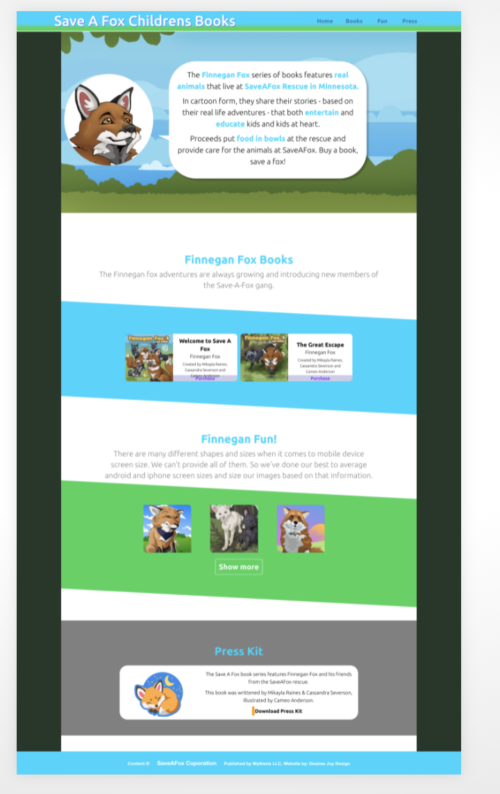

# Live Version
[Live Site](https://desireejoy.github.io/SaveAFox-temp/)

#SaveAFox is a fox rescue located in Minnesota. This website is for their promotional childrens books **The Adventures of Finnegan Fox**

## Technology

- Developed a responsive layout utilizing media queries to create a seamless experience across devices.
- Imported JSON data dynamically to streamline the process of making new products available.
- Used vanillaJS as well as REACT state variables to create a memory style matching game.
- Utilized React-Awesome-Reveal library for onScroll Animation to create a dynamic user experience.

### Screenshots

